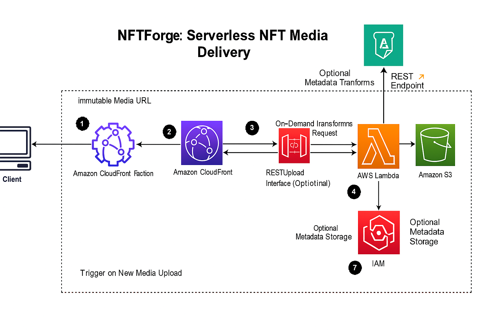

# NFTForge  
## 🖼️ NFT Media Delivery on AWS  

NFTForge is a secure, scalable, and cost-efficient platform designed to host, process, and deliver NFT (Non-Fungible Token) media files. Built using modern serverless architecture on AWS, this solution ensures optimized, tamper-proof, and globally distributed NFT assets, ideal for marketplaces, galleries, and smart contract integration.

---

## 🚀 Solution Overview  

This project uses a suite of AWS services such as **Amazon S3**, **AWS Lambda**, **Amazon CloudFront**, and **IAM** to build a high-performance pipeline for managing NFT-related content. The system dynamically processes images using the **Sharp** library and serves them efficiently across web and mobile platforms.

### Highlights:
- 🌐 Global media delivery via CloudFront.
- ⚙️ Real-time image processing (resizing, format conversion, watermarking).
- 🔐 Secure architecture with IAM roles and S3 bucket policies.
- 🧱 Blockchain-ready asset URLs and metadata handling.

---

## 🖼️ Architecture  

### Core Features:
- **Serverless Architecture**: Reduces cost and simplifies scaling.
- **Event-Driven Processing**: New media uploads to S3 automatically trigger Lambda functions.
- **Dynamic Media Handling**: Images are transformed on-the-fly based on screen size or URL parameters.
- **Immutable Delivery URLs**: Ideal for tokenized use in NFTs.

### Components Used:
- **Amazon S3** – Stores raw and processed NFT media.
- **AWS Lambda** – Performs image transformations.
- **Amazon CloudFront** – Globally caches and delivers media with low latency.
- **Amazon API Gateway (Optional)** – For RESTful upload/retrieve endpoints.
- **Amazon DynamoDB (Optional)** – Stores metadata like owner ID, timestamps.
- **IAM** – Controls secure access to AWS resources.
- **Amazon EC2 (Optional)** – For auxiliary processing, dashboards, or monitoring.

---

## 📌 Key Features  

- ✅ Real-time image resizing, formatting, and watermarking.  
- ✅ Fast and secure delivery via CDN (CloudFront).  
- ✅ Optimized for both desktop and mobile NFT marketplaces.  
- ✅ Fully serverless and scalable infrastructure.  
- ✅ Optional metadata storage for deeper blockchain integration.

---

## 🧠 Learning Outcomes  

By deploying this project, you’ll gain hands-on experience with:
- Designing **event-driven AWS pipelines** with S3 and Lambda.
- Implementing **secure and scalable image hosting** for NFTs.
- Managing **access policies and bucket permissions** with IAM.
- Using **CDN caching strategies** to optimize decentralized content.
- Handling **NFT asset lifecycle** from upload to public blockchain use.

---

## 📸 Example Use Case  

- A user uploads an NFT artwork via the frontend.  
- The image is stored in S3 and processed (resized/watermarked) by Lambda.  
- CloudFront delivers the image globally with caching.  
- Metadata is stored (optional) and a permanent URL is returned for smart contract use.

---

> Built with ❤️ for the next generation of digital creators.
